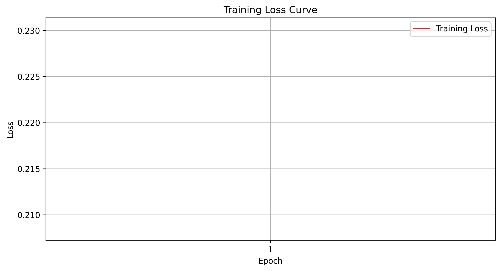
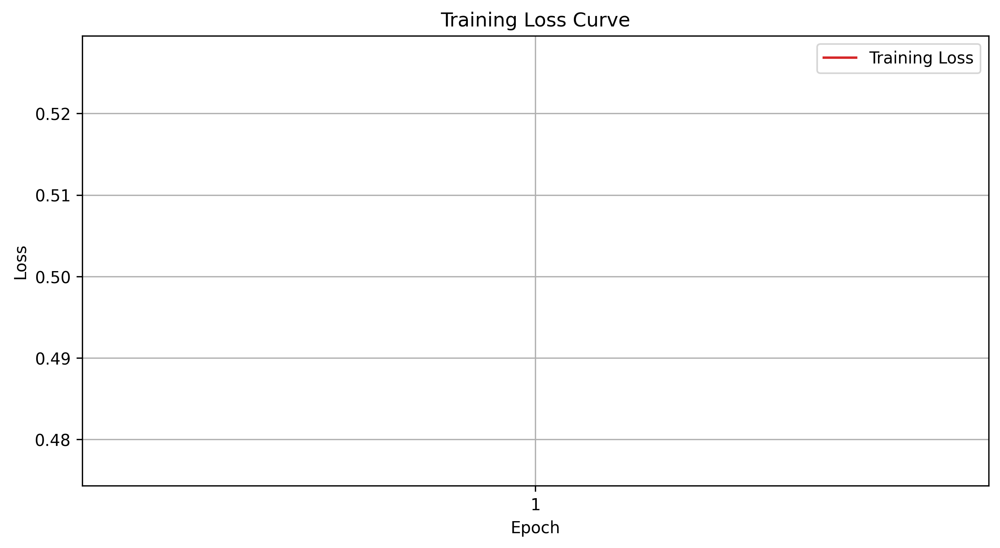

# LEVEL2

用 CNN 完成 MNIST 手写数字识别与 FashionMNIST 衣物分类。

**主要代码：** `LV2_CNN.py` 与 `LV2_CNN_2.py`

| 项目 | 内容                                                                                      |
| :--- |:----------------------------------------------------------------------------------------|
| 模型结构 | 卷积层(32) -> 池化 -> 卷积层(64) -> 池化 -> 全连接(128) -> 全连接(64) -> 10 (卷积层用 ReLU 激活，最后一层用softmax） |
| 损失函数 | CrossEntropyLoss                                                                        |
| 优化器 | Adam                                                                                    |

- 两个文件代码完全一致，只有数据集不同：`LV2_CNN.py` 用 MNIST，`LV2_CNN_2.py` 用 FashionMNIST
- 训练结束后保存 loss 曲线到 `draw/CNN_DRAW.png`、模型权重保存到 `./model/level2_CNN.pth`（`LV2_CNN_2.py` 对应 `CNN_DRAW_2.png` 与 `level2_CNN_2.pth`）
- 因为已经进行了训练，所以在最后的执行函数中，对train函数进行了注释，运行程序仅得到测试结果准确率
- 如果需要重新训练，要将注释取消

## 网络结构

- 卷积层1：输入 1×28×28，32 个 3×3 卷积核，padding=1，输出 32×28×28  +  RELU激活函数
- 池化层1：2×2 最大池化，输出 32×14×14
- 卷积层2：输入 32×14×14，64 个 3×3 卷积核，padding=1，输出 64×14×14  +  RELU激活函数
- 池化层2：2×2 最大池化，输出 64×7×7
- 将图片得到的tensor类型展开：64×7×7 = 3136
- 全连接层1：输入3136，输出128个神经元  +  RELU激活函数
- 全连接层2：输入上一层的128个神经元，输出64个神经元  +  RELU激活函数
- 全连接层3（output）：输入上一层的64个神经元，输出10个神经元，即最后分类的类别

## 超参数：

```python
BATCH_SIZE = 64                # 每次从数据加载器输入的样本数
EPOCHS = 10                    # 训练的轮数（LV2_CNN_2.py 为 20）
LR = 0.001                     # 学习率
HIDDEN1 = 32                   # 第一个卷积层输出通道数
HIDDEN2 = 64                   # 第二个卷积层输出通道数
HIDDEN3 = 128                  # 第一个全连接层神经元个数
HIDDEN4 = 64                   # 第二个全连接层神经元个数
torch.manual_seed(0)           # 设置随机种子，这样结果可以复现
```

## MNIST 训练结果（十轮）：

| epoch | loss | acc | time |
| ---: | ---: | ---: | ---: |
| 1 | 0.21820 | 0.9320 | 6.134s |
| 2 | 0.05676 | 0.9820 | 5.922s |
| 3 | 0.03860 | 0.9880 | 5.627s |
| 4 | 0.02925 | 0.9909 | 5.869s |
| 5 | 0.02381 | 0.9928 | 5.842s |
| 6 | 0.01890 | 0.9940 | 5.872s |
| 7 | 0.01436 | 0.9956 | 6.114s |
| 8 | 0.01181 | 0.9964 | 5.842s |
| 9 | 0.01200 | 0.9962 | 5.844s |
| 10 | 0.00920 | 0.9969 | 6.076s |

## FashionMNIST 训练结果（二十轮）：

| epoch | loss | acc | time |
| ---: | ---: | ---: | ---: |
| 1 | 0.50149 | 0.8177 | 6.065s |
| 2 | 0.30863 | 0.8889 | 5.956s |
| 3 | 0.25796 | 0.9059 | 6.111s |
| 4 | 0.22780 | 0.9169 | 5.945s |
| 5 | 0.20419 | 0.9243 | 6.006s |
| 6 | 0.18136 | 0.9328 | 6.040s |
| 7 | 0.16305 | 0.9397 | 5.926s |
| 8 | 0.14634 | 0.9460 | 6.124s |
| 9 | 0.12893 | 0.9525 | 5.956s |
| 10 | 0.11266 | 0.9577 | 5.906s |
| 11 | 0.09789 | 0.9642 | 6.128s |
| 12 | 0.08354 | 0.9691 | 5.989s |
| 13 | 0.07146 | 0.9737 | 5.917s |
| 14 | 0.06354 | 0.9757 | 6.111s |
| 15 | 0.05613 | 0.9790 | 5.939s |
| 16 | 0.04748 | 0.9833 | 6.006s |
| 17 | 0.04209 | 0.9843 | 6.056s |
| 18 | 0.03694 | 0.9865 | 5.956s |
| 19 | 0.03701 | 0.9862 | 6.106s |
| 20 | 0.03226 | 0.9884 | 5.939s |

## 测试结果：

| 数据集 | 主要代码 | 权重文件 | 损失曲线 | Acc |
| :--- | :--- | :--- | :--- | ---: |
| MNIST | `LV2_CNN.py` | `level2_CNN.pth` | `CNN_DRAW.png` | **0.98860** |
| FashionMNIST | `LV2_CNN_2.py` | `level2_CNN_2.pth` | `CNN_DRAW_2.png` | **0.91630** |

## 损失曲线：




