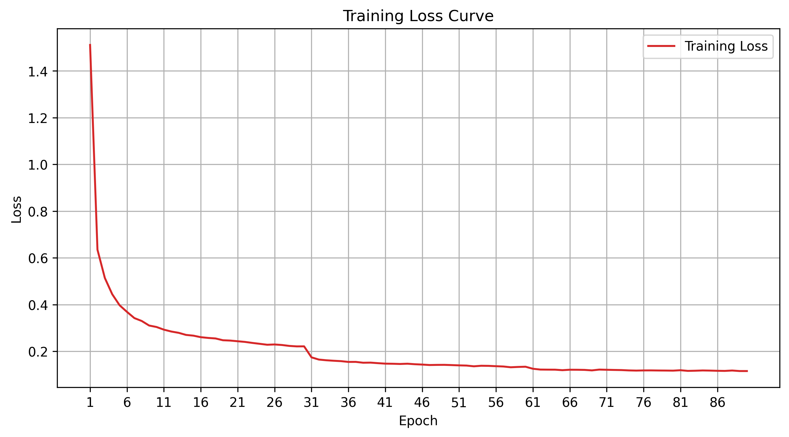

# LEVEL3-AlexNet

用AlexNet结构的CNN完成FashionMNIST的识别。

**主要代码：** `LV3_AlexNet.py`

| 项目 | 内容 |
| :--- | :--- |
| 模型结构 | 5 个卷积层 + 3 个全连接层（卷积通道 64 -> 192 -> 384 -> 256 -> 256，全连接 1024 -> 512 -> 10） |
| 损失函数 | CrossEntropyLoss |
| 优化器 | SGD（momentum=0.9，weight_decay=5e-4） |
| 学习率调度 | StepLR，每 30 轮 ×0.1（0.01 -> 0.001 -> 0.0001） |
| 数据增强 | 训练集：RandomCrop(28, padding=4) + RandomHorizontalFlip()；测试集只做 ToTensor() |
| Dropout | 两个全连接层前各接 0.5 |

- 训练得到的损失函数图像保存在：`./draw/AlexNet_DRAW.png`
- 训练得到的权重保存在：`./model/LV3_AlexNet.pth`
- 因为已经进行了训练，所以在最后的执行函数中，对train函数进行了注释，运行程序仅得到测试结果准确率
- 如果需要重新训练，要将注释取消，训练流程大概耗时10分钟

## 网络结构：

- 卷积层1：输入 1×28×28，64 个 5×5 卷积核，padding=2，输出 64×28×28  +  RELU激活函数
- 池化层1：3×3 最大池化，stride=2，输出 64×13×13
- 卷积层2：输入 64×13×13，192 个 5×5 卷积核，padding=2，输出 192×13×13  +  RELU激活函数
- 池化层2：3×3 最大池化，stride=2，输出 192×6×6
- 卷积层3：输入 192×6×6，384 个 3×3 卷积核，padding=1，输出 384×6×6  +  RELU激活函数
- 卷积层4：输入 384×6×6，256 个 3×3 卷积核，padding=1，输出 256×6×6  +  RELU激活函数
- 卷积层5：输入 256×6×6，256 个 3×3 卷积核，padding=1，输出 256×6×6  +  RELU激活函数
- 池化层3：3×3 最大池化，stride=2，输出 256×2×2
- 将图片得到的tensor类型展开：256×2×2 = 1024
- Dropout(0.5)
- 全连接层1：输入1024，输出1024个神经元  +  RELU激活函数
- Dropout(0.5)
- 全连接层2：输入上一层的1024个神经元，输出512个神经元  +  RELU激活函数
- 全连接层3（output）：输入上一层的512个神经元，输出10个神经元，即最后分类的类别

> **与原版 AlexNet 的差异：** 原版输入是 224×224 彩色图，第一个卷积层用 11×11、stride=4。直接套到 28×28 灰度图上会把特征图压没，所以这里把卷积核改小（5×5 / 3×3）、通道数等比缩小。其余结构特征全部保留：5 个卷积层、通道先增后减、重叠池化（kernel 3 / stride 2）、以及全连接层前的 dropout。

## 超参数：

```python
BATCH_SIZE = 64                # 每次从数据加载器输入的样本数
EPOCHS = 90                    # 训练的轮数（原版 AlexNet 是 90 轮）
LR = 0.01                      # 学习率（SGD 要用比 Adam 更大的学习率）
MOMENTUM = 0.9                 # SGD 动量（原版 AlexNet 的值）
WEIGHT_DECAY = 5e-4            # 权重衰减（原版 AlexNet 的值）
HIDDEN1 = 64                   # 第一个卷积层输出通道数
HIDDEN2 = 192                  # 第二个卷积层输出通道数
HIDDEN3 = 384                  # 第三个卷积层输出通道数
HIDDEN4 = 256                  # 第四个卷积层输出通道数
HIDDEN5 = 256                  # 第五个卷积层输出通道数
HIDDEN6 = 1024                 # 第一个全连接层神经元个数
HIDDEN7 = 512                  # 第二个全连接层神经元个数
torch.manual_seed(0)           # 设置随机种子，这样初始权重一致
```

## 训练结果：

（中间轮次省略，只列出第 1~5 轮和每 10 轮的结果）

| epoch | loss | acc | lr | time |
| ---: | ---: | ---: | ---: | ---: |
| 1 | 1.51131 | 0.4215 | 0.01000 | 14.892s |
| 2 | 0.63507 | 0.7549 | 0.01000 | 5.742s |
| 3 | 0.51400 | 0.8044 | 0.01000 | 6.032s |
| 4 | 0.44456 | 0.8359 | 0.01000 | 5.821s |
| 5 | 0.39722 | 0.8535 | 0.01000 | 5.766s |
| 10 | 0.30430 | 0.8894 | 0.01000 | 5.789s |
| 20 | 0.24617 | 0.9121 | 0.01000 | 5.933s |
| 30 | 0.22147 | 0.9202 | 0.01000 | 6.839s |
| 40 | 0.14952 | 0.9474 | 0.00100 | 6.322s |
| 50 | 0.14127 | 0.9487 | 0.00100 | 6.229s |
| 60 | 0.13429 | 0.9525 | 0.00100 | 6.217s |
| 70 | 0.12202 | 0.9574 | 0.00010 | 6.681s |
| 80 | 0.11744 | 0.9597 | 0.00010 | 6.458s |
| 90 | 0.11574 | 0.9593 | 0.00010 | 6.471s |

损失曲线已保存为 `./draw\AlexNet_DRAW.png`


## 测试结果：

| 数据集 | 主要代码 | 权重文件 | 损失曲线 | Acc |
| :--- | :--- | :--- | :--- | ---: |
| FashionMNIST | `LV3_AlexNet.py` | `LV3_AlexNet.pth` | `AlexNet_DRAW.png` | **0.93470** |


