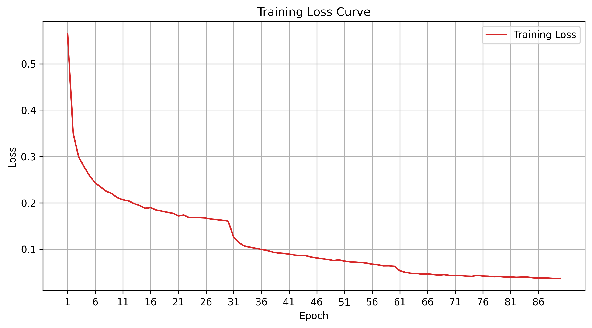

# LEVEL3-ResNet

用ResNet结构的CNN完成FashionMNIST的识别。

**主要代码：** `LV3_ResNet.py`

| 项目 | 内容 |
| :--- | :--- |
| 模型结构 | ResNet-18（4 个 stage × 2 个残差块），通道 32 -> 64 -> 128 -> 256，全局平均池化后接 10 类全连接 |
| 核心组件 | BasicBlock：两个 3×3 卷积 + BatchNorm，输出与输入相加（残差连接） |
| 损失函数 | CrossEntropyLoss |
| 优化器 | SGD（momentum=0.9，weight_decay=5e-4） |
| 学习率调度 | StepLR，每 30 轮 ×0.1（0.01 -> 0.001 -> 0.0001） |
| 数据增强 | 训练集：RandomCrop(28, padding=4) + RandomHorizontalFlip()；测试集只做 ToTensor() |
| 网络参数量 | 2,797,034 |

- 训练得到的损失函数图像保存在：`./draw/ResNet_DRAW.png`
- 训练得到的权重保存在：`./model/LV3_ResNet.pth`
- 因为已经进行了训练，所以在最后的执行函数中，对train函数进行了注释，运行程序仅得到测试结果准确率
- 如果需要重新训练，要将注释取消，训练流程大概耗时15分钟

## 网络结构：

- 主干卷积：输入 1×28×28，32 个 3×3 卷积核，stride=1，padding=1，输出 32×28×28，接 BatchNorm + RELU激活函数
- stage1：2 个残差块，通道数 32，stride=1，输出 32×28×28
- stage2：2 个残差块，通道数 64，第 1 个块 stride=2，输出 64×14×14
- stage3：2 个残差块，通道数 128，第 1 个块 stride=2，输出 128×7×7
- stage4：2 个残差块，通道数 256，第 1 个块 stride=2，输出 256×4×4
- 全局平均池化：256×4×4 -> 256×1×1
- 将图片得到的tensor类型展开：256
- 全连接层（output）：输入256，输出10个神经元，即最后分类的类别

其中每个残差块（BasicBlock）的结构是：

- 主路：3×3 卷积 -> BatchNorm -> RELU -> 3×3 卷积 -> BatchNorm
- 捷径：直接恒等映射；如果尺寸或通道数对不上，就用 1×1 卷积 + BatchNorm 变换过去
- 最后：主路 + 捷径，再过一次 RELU

注意整个网络**没有池化层做下采样**——28→14→7→4 这三次降采样都是靠残差块里 stride=2 的卷积完成的。池化只有最后那一次全局平均池化。

> **与原版 ResNet-18 的差异：** ① 原版第一层是 7×7、stride=2 的卷积，后面还跟一个 3×3 最大池化；28×28 的小图经不起连续两次下采样，所以按 CIFAR 版的做法换成 3×3、stride=1 的卷积，并且去掉那个最大池化层。② 原版通道数是 64/128/256/512（11.17M 参数），对 6 万张的 FashionMNIST 明显过剩（实测每轮要 23 秒），所以减半为 32/64/128/256（2.80M 参数，每轮约 10 秒）。残差块结构、四个 stage、stride=2 下采样、全局平均池化这些 ResNet 的核心设计全部保留。

## 超参数：

```python
BATCH_SIZE = 64                # 每次从数据加载器输入的样本数
EPOCHS = 90                    # 训练的轮数
LR = 0.01                      # 学习率（SGD 要用比 Adam 更大的学习率）
MOMENTUM = 0.9                 # SGD 动量
WEIGHT_DECAY = 5e-4            # 权重衰减
HIDDEN1 = 32                   # 第 1 个 stage 的输出通道数（原版 ResNet-18 是 64）
HIDDEN2 = 64                   # 第 2 个 stage 的输出通道数（原版是 128）
HIDDEN3 = 128                  # 第 3 个 stage 的输出通道数（原版是 256）
HIDDEN4 = 256                  # 第 4 个 stage 的输出通道数（原版是 512）
NUM_BLOCKS = 2                 # 每个 stage 里残差块的个数（2 个即 ResNet-18）
torch.manual_seed(0)           # 设置随机种子，这样初始权重一致
```

## 训练结果：

（前 20 轮逐轮列出，之后每 10 轮列出一次）

| epoch | loss | acc | lr | time |
| ---: | ---: | ---: | ---: | ---: |
| 1 | 0.56486 | 0.7893 | 0.01000 | 24.608s |
| 2 | 0.35024 | 0.8703 | 0.01000 | 9.541s |
| 3 | 0.29874 | 0.8914 | 0.01000 | 9.488s |
| 4 | 0.27717 | 0.8987 | 0.01000 | 9.124s |
| 5 | 0.25782 | 0.9040 | 0.01000 | 9.006s |
| 6 | 0.24294 | 0.9106 | 0.01000 | 9.207s |
| 7 | 0.23383 | 0.9139 | 0.01000 | 9.391s |
| 8 | 0.22465 | 0.9172 | 0.01000 | 9.007s |
| 9 | 0.22001 | 0.9192 | 0.01000 | 9.386s |
| 10 | 0.21086 | 0.9234 | 0.01000 | 9.459s |
| 11 | 0.20638 | 0.9252 | 0.01000 | 9.460s |
| 12 | 0.20419 | 0.9258 | 0.01000 | 9.864s |
| 13 | 0.19823 | 0.9279 | 0.01000 | 9.366s |
| 14 | 0.19413 | 0.9302 | 0.01000 | 9.719s |
| 15 | 0.18803 | 0.9317 | 0.01000 | 9.434s |
| 16 | 0.18952 | 0.9313 | 0.01000 | 10.096s |
| 17 | 0.18437 | 0.9341 | 0.01000 | 10.935s |
| 18 | 0.18211 | 0.9335 | 0.01000 | 9.619s |
| 19 | 0.17956 | 0.9342 | 0.01000 | 9.933s |
| 20 | 0.17736 | 0.9360 | 0.01000 | 9.586s |
| 30 | 0.16038 | 0.9417 | 0.01000 | 10.051s |
| 40 | 0.09065 | 0.9680 | 0.00100 | 9.744s |
| 50 | 0.07655 | 0.9727 | 0.00100 | 10.221s |
| 60 | 0.06313 | 0.9777 | 0.00100 | 9.911s |
| 70 | 0.04325 | 0.9856 | 0.00010 | 10.135s |
| 80 | 0.03977 | 0.9870 | 0.00010 | 9.728s |
| 90 | 0.03686 | 0.9878 | 0.00010 | 11.731s |

损失曲线已保存为 `./draw\ResNet_DRAW.png`

**注意：** 学习率分别在第 30、60 轮结束时降为原来的 1/10，lr 那一列能直接看到台阶。第 20 轮到第 30 轮准确率只涨了 0.57 个点（0.9360 -> 0.9417），而第 30 轮到第 40 轮涨了 2.63 个点（0.9417 -> 0.9680）——**如果只看前 30 轮，会误以为模型到 94% 就到顶了，其实是被过大的学习率卡住了。**

## 测试结果：

| 数据集 | 主要代码 | 权重文件 | 损失曲线 | Acc |
| :--- | :--- | :--- | :--- | ---: |
| FashionMNIST | `LV3_ResNet.py` | `LV3_ResNet.pth` | `ResNet_DRAW.png` | **0.95120** |

**训练集 99.46% / 测试集 95.12%，泛化差距 4.34 个百分点。**


